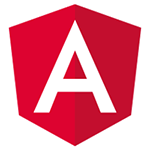
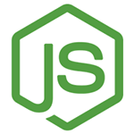

# FlatInventory

## Project Summary

**Flat Inventory** is a single page application that allows property owners that rent they home/apartmetns short term (AirBnb, Booking.com, etc) to manage the stock of their apartments.

I develop the application following the PWA (Progressive Web App) manifesto and it can we installed on every **Android phone** running **Chrome 38 or newver**.
It can also be added to the drower on any **iOS** device but until Safari is not fully supporting **Service Workers** notifications and offline features are limied.

### Live Demo

(coming soon)

## Technologies Used

- **Angular 6**
- **Angular Material**
- **PWA Manifesto**
- **Service Workers**
- **Node.JS 10**
- **Express.JS**
- **MongoDB**
- **PM2**
- **TypeScript**
- **JWT**
- **Bcrypt.JS**
- **SCSS**

--

During the development process I used also the following tools:

- **Postman**: to test the API
- **Robo 3T**: MongoDB management tool
- **Visual Studio Code**: GUI
- **Trello**: as project management tool
- **Omnigraffle**: to create the ERD
- **Adobe XD**: to create the wireframe and mokeup
- **Photoshop CC**: as photo editor
- **Heroku**: to deploy the application
- **mLab**: ad database hosting provider

## Further Developments

**v.1.1**
Login with Facebook, Google and Twitter

**v.2.0**
AirBnb and Tesco API for managing reservations and Stock

## How to run the application locally

### Development server

Run `nodemon bin/www` for a dev node environment. The API will listen to `http://localhost:3000/`

Run `ng serve` for a dev server. Navigate to `http://localhost:4200/`. The app will automatically reload if you change any of the source files.

### Build

Run `ng build` to build the project. The build artifacts will be stored in the `dist/` directory. Use the `-prod` flag for a production build.

### Running unit tests

Run `ng test` to execute the unit tests via [Karma](https://karma-runner.github.io).

### Running end-to-end tests

Run `ng e2e` to execute the end-to-end tests via [Protractor](http://www.protractortest.org/).
Before running the tests make sure you are serving the app via `ng serve`.